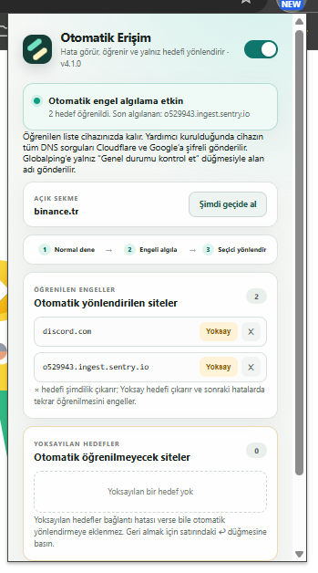
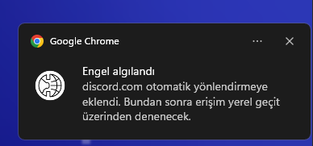

# Otomatik Erişim

Otomatik Erişim, Chrome'da bağlantı hatası yaşayan ana sayfa ve gömülü kaynakları algılayıp yalnızca sorunlu alan adlarını kullanıcının bilgisayarındaki yerel uyumluluk geçidine yönlendiren açık kaynaklı bir ağ aracıdır.

Kullanıcının hangi sitelerin engelli olduğunu önceden bilmesi, uzun alan adı listeleri hazırlaması veya bütün internet trafiğini bir VPN'e göndermesi gerekmez. Çalışan siteler normal bağlantıyı kullanmaya devam eder; yalnız sorun yaşanan hedeflere müdahale edilir.

Bir engel ilk kez algılanıp hedef otomatik yönlendirmeye eklendiğinde gösterilen bildirim:

## Kısaca ne yapar?

1. Bir siteyi önce normal internet bağlantısıyla açmayı dener.
2. Bağlantının sıfırlandığını, zaman aşımına uğradığını, boş yanıt verdiğini veya TLS aşamasında kesildiğini algılar.
3. Sorunlu alan adını öğrenilen hedefler listesine ekler.
4. Yalnız bu alan adını bilgisayardaki yerel DPI geçidine yönlendirir.
5. Diğer bütün siteleri doğrudan bağlantıda bırakır.

Örneğin Reddit normal açılırken bir gönderideki video kaynağı engelliyse bütün Reddit trafiği yönlendirilmez. Yalnızca videoyu sağlayan alan adı öğrenilir ve sonraki isteğinde yerel geçitten geçirilir. Açık gönderi ve sayfadaki konum korunur.

## DPI nedir?

DPI, **Deep Packet Inspection** yani **Derin Paket İnceleme** ifadesinin kısaltmasıdır. İnternet sağlayıcıları ve ağ yöneticileri, bağlantıların yalnızca hangi adrese gittiğine değil, paketlerin belirli teknik özelliklerine de bakarak trafiği sınıflandırabilir. Bazı erişim engelleri bu inceleme sırasında bağlantının kesilmesi, sıfırlanması veya yanıtsız bırakılmasıyla uygulanır.

Bu projede kullanılan DPI uyumluluk yöntemi şifre kırmaz ve site güvenlik denetimlerini geçersiz kılmaz. Bağlantının ağ üzerinde gönderiliş biçimini değiştirir. HTTPS bağlantısı uçtan uca şifreli kalır; eklenti sertifika kurmaz, TLS içeriğini çözmez ve sayfa içeriğini okumaz. Bir hedefe teknik olarak bağlanabilmek, o hedefe erişim yetkisi vermez.

Bu yöntem IP adresinizi veya ülkenizi değiştirmez. Dolayısıyla bir VPN değildir.

## Neden bütün internet yerine yalnız sorunlu siteler?

Bir DPI yöntemini bütün bağlantılara uygulamak gereksiz yan etkilere neden olabilir. Otomatik Erişim bu yüzden seçici çalışır.

- **Daha az müdahale:** Sorunsuz çalışan sitelerin bağlantısına dokunulmaz.
- **Daha iyi performans:** Bütün internet trafiği ek işlemden geçirilmez.
- **Daha düşük gecikme:** Oyun, bankacılık, alışveriş ve günlük siteler doğrudan bağlanmaya devam eder.
- **Daha yüksek uyumluluk:** DPI parametrelerinden etkilenebilecek siteler gereksiz yere geçide alınmaz.
- **Daha iyi gizlilik:** Trafik uzak bir VPN veya ticari proxy sunucusuna taşınmaz; SOCKS5 geçidi kullanıcının kendi bilgisayarında çalışır.
- **Kolay denetim:** Öğrenilen alan adları popup içinde görülebilir, elle eklenebilir veya listeden çıkarılabilir.

## Özellikler

### Otomatik hedef öğrenme

Eklenti ana sayfa, iframe, video, görsel, XHR/API, WebSocket ve diğer desteklenen isteklerde bağlantı engeline benzeyen hataları izler. Sorunlu hedefi kalıcı olarak öğrenir ve seçici PAC kuralını günceller.

Reklam engelleyicilerin oluşturduğu `ERR_BLOCKED_BY_CLIENT` hataları ve iptal edilmiş istekler öğrenilmez.

Bir alan adı ilk kez otomatik öğrenildiğinde Chrome bildirimi gösterilir. Bildirim, hedefin artık yerel geçit üzerinden yeniden deneneceğini açıklar.

Bildirimler yüksek öncelikli ve kullanıcı kapatana kadar görünür olacak şekilde oluşturulur. Aynı hedef silinip yeniden öğrenildiğinde eski bildirim kaydı temizlenerek yeni bildirim üretilir. **Yerel geçit ayarı → Bildirimi test et** düğmesi Chrome/Windows bildirim zincirini sınamak için kullanılabilir; Chrome bildirimi kabul ettiği halde ekranda görünmüyorsa Windows Bildirim Merkezi ve **Rahatsız etmeyin** ayarı kontrol edilmelidir.

### Sayfa durumunu koruyan yeniden deneme

Doğrudan açılan ana sayfa başarısızsa yeni bağlantı kuralı uygulandıktan sonra sekme bir kez yenilenir. Hata bir gönderinin içindeki video, görsel, iframe veya API kaynağındaysa üst sayfa yenilenmez. Böylece açık gönderi, form durumu, kaydırma konumu ve tek sayfa uygulamalarının oturumu korunur.

### Elle ekleme, çıkarma ve kalıcı yoksayma

Popup, açık sekmenin alan adını gösterir. Kullanıcı **Şimdi geçide al** düğmesiyle hedefi elle ekleyebilir. Öğrenilen hedefler ayrı satırlarda gösterilir. `×` hedefi yönlendirmeden çıkarır ancak sonraki bağlantı hatasında yeniden öğrenilmesine izin verir. **Yoksay** hedefi hem yönlendirmeden çıkarır hem tekrar otomatik öğrenilmesini engeller.

Yoksayılan hedefler ayrı listede görülebilir ve `↩` düğmesiyle yeniden otomatik algılamaya açılabilir. Bir üst alan adı yoksayılırsa alt alan adları da yoksayılmış kabul edilir.

### DNS engelleri için şifreli çözümleme

Bazı ağlar engelli alan adları için yanlış DNS yanıtı döndürür veya hiç yanıt vermez. Kurulum yardımcısı bu durumlar için yalnız loopback üzerinde çalışan yerel bir `dnsproxy` görevi kurar. DNS sorguları HTTPS ile Cloudflare ve Google çözümleyicilerine gönderilir.

Bu DNS kuralı sistem genelinde etkilidir: cihazdaki diğer uygulamaların sorguları da Cloudflare ve Google'a gider. Kurucu bunu değişiklik yapmadan önce açıkça bildirip `EVET` onayı ister. `helper/uninstall.cmd`, yalnız Otomatik Erişim'e ait görev ve DNS kuralını geri alır.

### Dışarıdan genel durum kontrolü

DNS veya bağlantı hatası görüldüğünde kullanıcı **Genel durumu kontrol et** düğmesine basabilir. Hedef, Globalping üzerinden Avrupa, Kuzey Amerika ve Asya'daki üç dış noktadan sınanır.

- Birden fazla dış nokta siteye ulaşabiliyorsa sorun yerel, DNS kaynaklı veya bölgesel olabilir.
- Birden fazla kıtadan da ulaşılamıyorsa hedef yönlendirme listesine eklenmez; popup durumu ve **Genel kesinti olası** Chrome bildirimi gösterilir.
- DNS hatası yaşayan hedef dışarıdan açık olarak doğrulanırsa öğrenilen listeye eklenip yerel geçitle yeniden denenir.

Bu kontrol kendiliğinden çalışmaz. Yalnız düğmeye basıldığında açık sekmenin alan adı Globalping'e gönderilir.

### Durum göstergeleri

Araç çubuğu rozeti ve popup; otomatik algılamanın durumunu, yeni öğrenilen hedefleri, DNS sorunlarını, olası genel kesintileri ve yerel proxy hatalarını gösterir.

### Kalıcı ve düzenlenebilir liste

Öğrenilen alan adları Chrome'un yerel eklenti deposunda saklanır ve bilgisayar yeniden başlatıldığında kaybolmaz. Liste popup üzerinden düzenlenebilir.

## Teknik çalışma akışı

Chrome bağlantıları başlangıçta doğrudandır. Desteklenen bir bağlantı hatası algılandığında:

1. Alan adı normalleştirilip tekrarlar ayıklanır.
2. Hedef yoksayılan listede değilse `chrome.storage.local` içindeki öğrenilen listeye eklenir.
3. PAC kuralı yalnız hedefi ve alt alan adlarını `127.0.0.1:1080` üzerindeki ByeDPI SOCKS5 geçidine gönderir.
4. Yerel ByeDPI hizmeti bağlantıya DPI atlatma profilini uygular.
5. Ana sayfa hatasıysa sekme bir kez yenilenir; gömülü kaynak hatasıysa sayfa yerinde bırakılır.

Yerel hizmetler yalnızca aşağıdaki loopback adreslerini dinler ve yerel ağdaki diğer cihazlara açılmaz:

- `127.0.0.1:1080`: ByeDPI SOCKS5 geçidi
- `127.0.0.2:53`: Şifreli DNS geçidi

## Kurulum

> Proje şu anda Windows ve Google Chrome için hazırlanmıştır.

### Kurmadan önce bilin

- Yardımcı, yönetici yetkisiyle iki yerel hizmet ve sistem geneli DNS kuralı kurar.
- Cihazdaki tüm DNS sorguları şifreli biçimde Cloudflare ve Google'a gönderilir; bu tarafların kendi gizlilik koşulları geçerlidir.
- Yönetilen/kurumsal cihazda ağ yöneticisinin izni gerekir. Kurucu başka bir sistem geneli NRPT kuralı bulursa çakışmayı önlemek için durur.
- Araç VPN veya anonimlik hizmeti değildir; IP adresini ya da ülkeyi değiştirmez ve erişim garantisi vermez.
- Kurulumdan önce [`PRIVACY.md`](PRIVACY.md) ve [`RESPONSIBLE_USE.md`](RESPONSIBLE_USE.md) belgelerini okuyun.

1. Depoyu indirin veya klonlayın.
2. [`helper/install.cmd`](helper/install.cmd) dosyasını çalıştırın ve Windows yönetici iznini onaylayın.
3. Chrome'da `chrome://extensions` adresini açın.
4. Sağ üstten **Geliştirici modu** seçeneğini etkinleştirin.
5. **Paketlenmemiş öğe yükle** düğmesine basıp proje klasörünü seçin.
6. Eklenti popup'ındaki ana anahtarı etkinleştirin.

### Güncelleme

1. Depodaki dosyaları güncelleyin.
2. `helper/install.cmd` dosyasını yeniden çalıştırın.
3. `chrome://extensions` sayfasında Otomatik Erişim kartındaki yenile simgesine basın.
4. Popup başlığındaki sürümün `manifest.json` ile eşleştiğini kontrol edin.

## İzinler neden gerekli?

- `webRequest` ve HTTP/HTTPS adres erişimi: Bağlantı hatalarını ve başarılı ana sayfa isteklerini algılamak.
- `notifications`: Bir hedef ilk kez otomatik öğrenildiğinde kullanıcıya erişimin hazır olduğunu bildirmek.
- `proxy`: Öğrenilen alan adları için seçici PAC/SOCKS5 yönlendirmesi uygulamak.
- `storage`: Ayarları, teşhis durumunu, öğrenilen ve yoksayılan hedefleri cihazda saklamak.
- `activeTab`: Popup açıldığında yalnız etkin sekmenin alan adını göstermek ve kullanıcı işlemlerini o sekmeyle ilişkilendirmek.

Eklenti sayfaya kod enjekte etmez, sayfa içeriğini değiştirmez ve HTTPS trafiğini çözmez.

## Güvenlik ve gizlilik

- Uzak VPN veya trafik proxy'si kullanılmaz. DPI geçidi tamamen kullanıcının bilgisayarındadır.
- HTTPS içeriği şifreli kalır; özel sertifika kurulmaz.
- Öğrenilen alan adları ve hata geçmişi geliştiriciye gönderilmez.
- DNS sorguları şifreli HTTPS üzerinden Cloudflare ve Google'a gönderilir. Bu sağlayıcılar sorgulanan alan adını ve kaynak IP adresini görebilir.
- Globalping'e yalnız kullanıcı genel durum kontrolünü başlattığında açık sekmenin alan adı gönderilir.
- Tam URL, sayfa içeriği ve öğrenilmiş alan adı listesinin tamamı dış servislere gönderilmez.
- Ana anahtar kapatıldığında Chrome proxy ayarı temizlenir.

Ayrıntılar için [`PRIVACY.md`](PRIVACY.md) dosyasına bakın.

## Sorumlu kullanım

Bu proje yalnız hukuka, yetkili makam kararlarına, ağ politikalarına ve üçüncü taraf hizmet şartlarına uygun kullanımlar için sunulur. Erişim kontrolü, hesap, ödeme duvarı, lisans veya güvenlik sınırlarını ihlal etme yetkisi vermez. Üçüncü taraf adları ve ekran görüntüleri yalnız arayüz örneğidir; proje bu hizmetlerle bağlantılı veya onlarca onaylanmış değildir. Ayrıntılar için [`RESPONSIBLE_USE.md`](RESPONSIBLE_USE.md) belgesine bakın.

## Kaldırma

1. Eklentiyi Chrome'dan kaldırın veya kapatın.
2. [`helper/uninstall.cmd`](helper/uninstall.cmd) dosyasını çalıştırın ve yönetici iznini onaylayın.

Kaldırma betiği ByeDPI hizmetini, yerel şifreli DNS görevini, proje etiketli DNS kuralını ve kurulu yardımcı dosyaları kaldırır.

## Sınırlar

- Yalnız Chrome trafiğini yönlendirir; masaüstü uygulamalarını kapsamaz.
- Bir sunucu gerçekten kapalıysa veya internet bağlantısı yoksa DPI atlatma bunu düzeltemez.
- Ağ sağlayıcıları engelleme yöntemlerini değiştirebilir; çalışan DPI profilinin ileride güncellenmesi gerekebilir.
- Başka bir eklenti veya kurumsal politika Chrome proxy ayarlarını kontrol ediyorsa iki yapı aynı anda çalışamayabilir.
- Şifreli DNS kuralı sistem genelindedir; cihazdaki diğer uygulamaların DNS çözümlemesini de etkiler.
- Kullanımın bulunduğunuz yerdeki mevzuata ve ağ kurallarına uygunluğunu kontrol etmek kullanıcının sorumluluğundadır.

## Üçüncü taraf bileşenler

- `helper/bin/ciadpi.exe`: [hufrea/byedpi](https://github.com/hufrea/byedpi)
- `helper/bin/dnsproxy.exe`: [AdGuardTeam/dnsproxy](https://github.com/AdguardTeam/dnsproxy)

Kaynak, sürüm, SHA-256 ve lisans bilgileri [`helper/bin/SOURCE.md`](helper/bin/SOURCE.md) ile [`THIRD_PARTY_NOTICES.md`](THIRD_PARTY_NOTICES.md) dosyalarında yer alır. GPL kapsamındaki dnsproxy'nin aynı sürüme ait karşılık gelen kaynak arşivi ikiliyle birlikte `helper/source/` altında sunulur.

## Lisans

Projenin kendi kodu MIT lisanslıdır. Birlikte dağıtılan üçüncü taraf bileşenler kendi lisans koşullarına tabidir.
