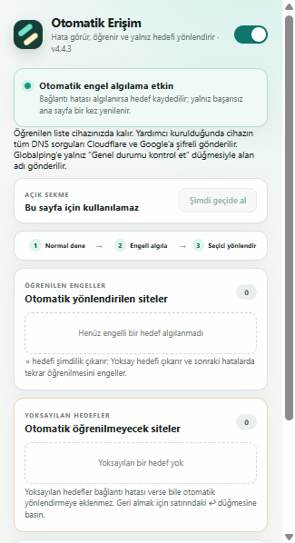

# Otomatik Erişim

Otomatik Erişim, Chrome'da bağlantı hatası yaşayan ana sayfa ve gömülü kaynakları algılayıp yalnızca sorunlu alan adlarını kullanıcının bilgisayarındaki yerel uyumluluk geçidine yönlendiren açık kaynaklı bir ağ aracıdır.

Güncel sürüm: **4.5.3**

Kullanıcının hangi sitelerin engelli olduğunu önceden bilmesi, uzun alan adı listeleri hazırlaması veya bütün internet trafiğini bir VPN'e göndermesi gerekmez. Çalışan siteler normal bağlantıyı kullanmaya devam eder; yalnız sorun yaşanan hedeflere müdahale edilir.

## Kısaca ne yapar?

1. Bir siteyi önce normal internet bağlantısıyla açmayı dener.
2. Erişim engeline benzeyen hatanın türünü ve isteğin ana sayfa mı yoksa gömülü kaynak mı olduğunu değerlendirir.
3. Aynı hedef doğrudan yanıt vermiyorsa yalnız tam alan adını öğrenilen hedefler listesine ekler.
4. Yalnız bu alan adını bilgisayardaki yerel DPI geçidine yönlendirir.
5. Diğer bütün siteleri doğrudan bağlantıda bırakır.

Örneğin bir sosyal akış normal açılırken gönderideki harici medya kaynağı engelliyse bütün ana sayfa trafiği yönlendirilmez. Yalnızca medyayı sağlayan alan adı öğrenilir ve sonraki isteğinde yerel geçitten geçirilir. Açık gönderi ve sayfadaki konum korunur.

## DPI nedir?

DPI, **Deep Packet Inspection** yani **Derin Paket İnceleme** ifadesinin kısaltmasıdır. İnternet sağlayıcıları ve ağ yöneticileri, bağlantıların yalnızca hangi adrese gittiğine değil, paketlerin belirli teknik özelliklerine de bakarak trafiği sınıflandırabilir. Bazı erişim engelleri bu inceleme sırasında bağlantının kesilmesi, sıfırlanması veya yanıtsız bırakılmasıyla uygulanır.

Bu projede kullanılan DPI uyumluluk yöntemi şifre kırmaz ve site güvenlik denetimlerini geçersiz kılmaz. Bağlantının ağ üzerinde gönderiliş biçimini değiştirir. HTTPS bağlantısı uçtan uca şifreli kalır; yerel yardımcı sertifika kurmaz veya TLS içeriğini çözmez. Bir hedefe teknik olarak bağlanabilmek, o hedefe erişim yetkisi vermez.

Bu yöntem IP adresinizi veya ülkenizi değiştirmez. Dolayısıyla bir VPN değildir.

## Neden bütün internet yerine yalnız sorunlu siteler?

Bir DPI yöntemini bütün bağlantılara uygulamak gereksiz yan etkilere neden olabilir. Otomatik Erişim bu yüzden seçici çalışır.

- **Daha az müdahale:** Sorunsuz çalışan sitelerin bağlantısına dokunulmaz.
- **Daha iyi performans:** Bütün internet trafiği ek işlemden geçirilmez.
- **Daha düşük gecikme:** Oyun, bankacılık, alışveriş ve günlük siteler doğrudan bağlanmaya devam eder.
- **Daha yüksek uyumluluk:** DPI parametrelerinden etkilenebilecek siteler gereksiz yere geçide alınmaz.
- **Daha iyi gizlilik:** Trafik uzak bir VPN veya ticari proxy sunucusuna taşınmaz; SOCKS5 geçidi kullanıcının kendi bilgisayarında çalışır.
- **Kolay denetim:** Öğrenilen alan adları popup içinde görülebilir, elle eklenebilir veya listeden çıkarılabilir.

## Özellikler

### Site bağımsız çalışma

Algılama ve yeniden deneme kuralları belirli bir hedefe, markaya veya sabit alan adı listesine bağlı değildir. Kararlar yalnız Chrome'un bildirdiği istek türü, bağlantı hatası, frame kimliği, başlatıcı alan ilişkisi ve doğrudan erişim doğrulamasına göre verilir. Kod ile arayüz örneklerinde gerçek hedef adları kullanılmaz; test ve önizleme verileri IANA'nın dokümantasyon için ayırdığı `.example` alan adlarıyla oluşturulur.

### Kamuya açık dağıtım

Proje bütün kullanıcılar için aynı genel yapılandırmayla geliştirilir. Kullanıcıya, cihaza veya ağa özgü DNS adresleri, öğrenilmiş hedefler, eklenti kimlikleri, mutlak dosya yolları ve hata günlükleri kaynak depoya eklenmez. Kurucu gerekli kullanıcı yollarını ve paketlenmemiş eklenti kimliğini yalnız kurulum sırasında yerel olarak belirler. Her sürüm değişikliğinde manifest, README ve davranışı açıklayan ilgili belgeler birlikte güncellenir.

### Otomatik hedef öğrenme

Eklenti ana sayfa, iframe, video, görsel, XHR/API, WebSocket ve diğer desteklenen isteklerde bağlantı engeline benzeyen hataları izler. Ana sayfadaki tek bir geçici hata hedefi öğrenmek için yeterli değildir. Tarayıcının çoğu zaman yalnız bir kez istediği gömülü kaynaklarda bağlantı sıfırlama/kapanma hatası hemen doğrulama aşamasına alınır. Her iki durumda da çerez gönderilmeyen, yalnız ilk baytı isteyen doğrudan içerik kontrolünün bağlantı kuramaması gerekir. Zaman aşımı ve TLS hataları tek başına otomatik öğrenmeye yol açmaz.

Öğrenilen kural yalnız hatayı veren tam alan adına uygulanır. Ana sayfa engelinde aynı sitenin `example.com` ve `www.example.com` eşleri birlikte eklenir; diğer alt alan adları kendiliğinden yönlendirilmez. Bu korumalar geçici sunucu, Wi-Fi ve tarayıcı hatalarının erişim engeli sanılması riskini azaltır. Gerçek bir engel otomatik doğrulanamazsa kullanıcı açık hedefi **Şimdi geçide al** ile elle ekleyebilir.

Reklam engelleyicilerin oluşturduğu `ERR_BLOCKED_BY_CLIENT` hataları ve iptal edilmiş istekler öğrenilmez.

Bir alan adı ilk kez otomatik öğrenildiğinde Chrome bildirimi gösterilir. Bildirim, hedefin artık yerel geçit üzerinden yeniden deneneceğini açıklar.

Kısa süre içinde art arda öğrenilen hedefler tek Chrome bildiriminde gruplanır. Bildirimler işletim sisteminin normal geçici bildirim davranışını kullanır ve ekranda kalmaya zorlanmaz. Aynı hedef listeden silinip daha sonra yeniden otomatik öğrenildiğinde yeni bildirim grubuna alınır. **Yerel geçit ayarı → Bildirimi test et** düğmesi Chrome/Windows bildirim zincirini sınamak için kullanılabilir; Chrome bildirimi kabul ettiği halde ekranda görünmüyorsa Windows Bildirim Merkezi ve **Rahatsız etmeyin** ayarı kontrol edilmelidir.

### Sayfa durumunu koruyan yeniden deneme

Doğrudan açılan ana sayfa başarısızsa yeni bağlantı kuralının Chrome ağ katmanına yerleşmesi için kısa süre beklenir ve sekme bir kez yenilenir. Harici bir iframe hedefi sonradan öğrenildiğinde içerik betiği üst sayfa ve açık Shadow DOM'larda yalnız eşleşen iframe'i hemen yeniden yükler. Iframe açıldıktan sonra kendi API veya medya bağımlılıkları da öğrenilirse bu hedefler kısa süre gruplanır ve yalnız başlatıcı iframe bir kez daha yüklenir. DOM eşleşmesi hata sonrası kaldırılmışsa Chrome'un bildirdiği alt çerçeve kimliği yedek olarak kullanılır; üst sayfa durumu korunur.

### Elle ekleme, çıkarma ve kalıcı yoksayma

Popup, açık sekmenin alan adını gösterir. Kullanıcı **Şimdi geçide al** düğmesiyle hedefi elle ekleyebilir. Öğrenilen hedefler ayrı satırlarda gösterilir. `×` hedefi yönlendirmeden çıkarır ancak sonraki bağlantı hatasında yeniden öğrenilmesine izin verir. **Yoksay** hedefi hem yönlendirmeden çıkarır hem tekrar otomatik öğrenilmesini engeller.

Yoksayılan hedefler ayrı listede görülebilir ve `↩` düğmesiyle yeniden otomatik algılamaya açılabilir. Bir üst alan adı yoksayılırsa alt alan adları da yoksayılmış kabul edilir.

### DNS engelleri için şifreli çözümleme

Bazı ağlar engelli alan adları için yanlış DNS yanıtı döndürür veya hiç yanıt vermez. Normal sorgular kullanıcının mevcut sistem ve ağ DNS yapılandırmasında kalır. Chrome yalnız ana sayfada DNS çözümleme hatası gördüğünde alan adını Cloudflare DoH ile çerezsiz olarak doğrular. Alternatif DNS adres döndürürse yalnız o tam alan adı için `127.0.0.2` üzerindeki yerel çözücüye seçici NRPT kuralı eklenir.

Genel `.` NRPT kuralı veya ağ bağdaştırıcısı DNS değişikliği yapılmaz. `dnsproxy` yalnız seçici listede en az bir hedef varken çalışır; liste boşaldığında durur. Alan adına özel kural Windows düzeyinde olduğundan aynı hedefi isteyen başka bir uygulamanın sorgusu da o sırada seçici çözücüye gidebilir. `helper/uninstall.cmd` yalnız Otomatik Erişim'e ait görevleri ve alan adına özel kuralları geri alır.

### Dışarıdan genel durum kontrolü

DNS veya bağlantı hatası görüldüğünde kullanıcı **Genel durumu kontrol et** düğmesine basabilir. Hedef, Globalping üzerinden Avrupa, Kuzey Amerika ve Asya'daki üç dış noktadan sınanır.

- Birden fazla dış nokta siteye ulaşabiliyorsa sorun yerel, DNS kaynaklı veya bölgesel olabilir.
- Birden fazla kıtadan da ulaşılamıyorsa hedef yönlendirme listesine eklenmez; popup durumu ve **Genel kesinti olası** Chrome bildirimi gösterilir.
- DNS hatası yaşayan hedef otomatik DoH doğrulamasında veya isteğe bağlı dış kontrolde açık bulunursa seçici DNS ve geçit listesine eklenip yeniden denenir.

Bu kontrol kendiliğinden çalışmaz. Yalnız düğmeye basıldığında açık sekmenin alan adı Globalping'e gönderilir.

### Durum göstergeleri

Araç çubuğu rozeti ve popup; otomatik algılamanın durumunu, yeni öğrenilen hedefleri, DNS sorunlarını, olası genel kesintileri ve yerel proxy hatalarını gösterir.

### Yerel hata ayıklama günlüğü

Popup içindeki **Hata ayıklama günlüğü** varsayılan olarak kapalıdır. Kullanıcı etkinleştirdiğinde algılama ve yeniden deneme sorunlarını incelemek için son 150 olayı yalnız cihazda tutar. Kayıtlarda zaman, alan adı, istek/hata türü, PAC uygulama sonucu ve sekme/iframe yeniden deneme aşaması bulunur; tam URL, sayfa içeriği, çerez veya form verisi kaydedilmez. Günlük kapatılabilir, kopyalanabilir veya tek düğmeyle temizlenebilir.

### Kalıcı ve düzenlenebilir liste

Öğrenilen alan adları Chrome'un yerel eklenti deposunda saklanır ve bilgisayar yeniden başlatıldığında kaybolmaz. Liste popup üzerinden düzenlenebilir.

## Teknik çalışma akışı

Chrome bağlantıları başlangıçta doğrudandır. Desteklenen bir bağlantı hatası algılandığında:

1. Alan adı normalleştirilip tekrarlar ayıklanır.
2. Hatanın türü ve isteğin ana sayfa mı gömülü kaynak mı olduğu kontrol edilir; zaman aşımı ve TLS hataları otomatik öğrenilmez.
3. Eşik aşılırsa aynı URL'ye çerezsiz, yalnız ilk baytı isteyen sınırlı bir `GET` isteğiyle gerçek içerik erişimi sınanır. Herhangi bir HTTP yanıtı alınırsa hedef eklenmez.
4. Doğrudan bağlantı da kurulamazsa hedef `chrome.storage.local` içindeki öğrenilen listeye eklenir.
5. PAC kuralı yalnız hatayı veren tam alan adını `127.0.0.1:1080` üzerindeki ByeDPI SOCKS5 geçidine gönderir.
6. Yerel ByeDPI hizmeti bağlantıya DPI atlatma profilini uygular.
7. Ana sayfa hatasıysa sekme bir kez yenilenir; gömülü kaynak hatasıysa sayfa yerinde bırakılır.

Yerel hizmetler yalnızca aşağıdaki loopback adreslerini dinler ve yerel ağdaki diğer cihazlara açılmaz:

- `127.0.0.1:1080`: ByeDPI SOCKS5 geçidi
- `127.0.0.2:53`: Yalnız seçici DNS hedefleri varken çalışan şifreli DNS geçidi

## Kurulum

> Proje şu anda Windows ve Google Chrome için hazırlanmıştır.

### Kurmadan önce bilin

- Yardımcı, yönetici yetkisiyle yerel geçidi ve alan adına özel DNS kurallarını uygulayan yerel köprüyü kurar.
- Kullanıcının sistem veya ağ DNS ayarı değiştirilmez. Yalnız mevcut çözümleyicinin açamadığı ve alternatif DNS'te doğrulanan hedefler Cloudflare ve Google DoH çözücülerine yöneltilir.
- Yönetilen/kurumsal cihazda ağ yöneticisinin izni gerekir. Yardımcı başka ürünlere ait DNS kurallarını değiştirmez.
- Araç VPN veya anonimlik hizmeti değildir; IP adresini ya da ülkeyi değiştirmez ve erişim garantisi vermez.
- Kurulumdan önce [`PRIVACY.md`](PRIVACY.md) ve [`RESPONSIBLE_USE.md`](RESPONSIBLE_USE.md) belgelerini okuyun.

1. Depoyu indirin veya klonlayın.
2. Chrome'da `chrome://extensions` adresini açın.
3. **Geliştirici modu**nu açıp **Paketlenmemiş öğe yükle** ile proje klasörünü seçin.
4. [`helper/install.cmd`](helper/install.cmd) dosyasını çalıştırın ve Windows yönetici iznini onaylayın. Kurucu yüklü eklenti kimliğini bulup yerel köprüyü yalnız bu eklentiye açar.
5. Kurulumdan sonra eklenti kartındaki yenile düğmesine bir kez basın.
6. Eklenti popup'ındaki ana anahtarı etkinleştirin.

### Güncelleme

1. Depodaki dosyaları güncelleyin.
2. `chrome://extensions` sayfasında Otomatik Erişim kartının kendi yenile simgesine basın. Sayfanın üstündeki genel **Güncelle** düğmesi paketlenmemiş proje dosyalarını indirmez.
3. Popup başlığındaki sürümün `manifest.json` ile eşleştiğini kontrol edin.
4. Yalnız güncelleme `helper/` klasörünü değiştirdiyse veya popup yerel yardımcının eksik olduğunu bildiriyorsa `helper/install.cmd` dosyasını yeniden çalıştırıp kartı bir kez daha yenileyin.

`helper/install.cmd` yönetici yetkisi gerektiren Windows hizmeti, görev ve yerel köprü kurulumu içindir; yalnız Chrome eklentisini yeniden yüklemek için çalıştırılmaz.

## İzinler neden gerekli?

- `webRequest` ve HTTP/HTTPS adres erişimi: Bağlantı hatalarını ve başarılı ana sayfa isteklerini algılamak.
- `notifications`: Bir hedef ilk kez otomatik öğrenildiğinde kullanıcıya erişimin hazır olduğunu bildirmek.
- `nativeMessaging`: Yalnız yerel DNS'in çözemediği doğrulanmış alan adlarını yönetici tarafından kurulmuş yerel DNS köprüsüne iletmek.
- `scripting`: Yalnız otomatik öğrenilen harici iframe'i üst sayfayı yenilemeden yeniden yüklemek.
- `proxy`: Öğrenilen alan adları için seçici PAC/SOCKS5 yönlendirmesi uygulamak.
- `storage`: Ayarları, teşhis durumunu, öğrenilen ve yoksayılan hedefleri cihazda saklamak.
- `activeTab`: Popup açıldığında yalnız etkin sekmenin alan adını göstermek ve kullanıcı işlemlerini o sekmeyle ilişkilendirmek.

Eklenti genel sayfa içeriğini toplamaz veya HTTPS trafiğini çözmez. Otomatik öğrenilen harici iframe'i üst sayfayı yenilemeden tekrar yüklemek için yalnız ilgili frame adresini DOM içinde bulup yeniler; bunun dışında sayfa içeriğini değiştirmez.

## Güvenlik ve gizlilik

- Uzak VPN veya trafik proxy'si kullanılmaz. DPI geçidi tamamen kullanıcının bilgisayarındadır.
- HTTPS içeriği şifreli kalır; özel sertifika kurulmaz.
- Öğrenilen alan adları ve hata geçmişi geliştiriciye gönderilmez.
- Hata ayıklama günlüğü yalnız Chrome'un yerel eklenti deposunda tutulur ve kullanıcı kendisi paylaşmadıkça cihazdan çıkmaz.
- Normal DNS sorguları mevcut sistem ve ağ DNS yapılandırmasında kalır. DNS hatası veren alan adı Cloudflare DoH ile otomatik doğrulanır; yalnız doğrulanan seçici hedeflerin sorguları Cloudflare ve Google'a şifreli gönderilir. Bu sağlayıcılar ilgili alan adını ve kaynak IP adresini görebilir.
- Globalping'e yalnız kullanıcı genel durum kontrolünü başlattığında açık sekmenin alan adı gönderilir.
- Otomatik doğrulama isteği üçüncü tarafa değil, yalnız hatayı veren hedef URL'ye doğrudan ve çerezsiz gönderilir.
- Tam URL, sayfa içeriği ve öğrenilmiş alan adı listesinin tamamı dış servislere gönderilmez.
- Ana anahtar kapatıldığında Chrome proxy ayarı temizlenir.

Ayrıntılar için [`PRIVACY.md`](PRIVACY.md) dosyasına bakın.

## Sorumlu kullanım

Bu proje yalnız hukuka, yetkili makam kararlarına, ağ politikalarına ve üçüncü taraf hizmet şartlarına uygun kullanımlar için sunulur. Erişim kontrolü, hesap, ödeme duvarı, lisans veya güvenlik sınırlarını ihlal etme yetkisi vermez. Üçüncü taraf adları ve ekran görüntüleri yalnız arayüz örneğidir; proje bu hizmetlerle bağlantılı veya onlarca onaylanmış değildir. Ayrıntılar için [`RESPONSIBLE_USE.md`](RESPONSIBLE_USE.md) belgesine bakın.

## Kaldırma

1. Eklentiyi Chrome'dan kaldırın veya kapatın.
2. [`helper/uninstall.cmd`](helper/uninstall.cmd) dosyasını çalıştırın ve yönetici iznini onaylayın.

Kaldırma betiği ByeDPI hizmetini, yerel DNS görevlerini, Chrome yerel köprüsünü, proje etiketli alan adına özel DNS kurallarını ve kurulu yardımcı dosyaları kaldırır.

## Sınırlar

- Yalnız Chrome trafiğini yönlendirir; masaüstü uygulamalarını kapsamaz.
- Bir sunucu gerçekten kapalıysa veya internet bağlantısı yoksa DPI atlatma bunu düzeltemez.
- Yerel hata belirtileri erişim engelini kesin olarak kanıtlayamaz. Tekrarlı hata ve doğrudan kontrol yanlış algılama riskini azaltır; kullanıcı gerekirse hedefi listeden çıkarabilir veya kalıcı olarak yoksayabilir.
- Ağ sağlayıcıları engelleme yöntemlerini değiştirebilir; çalışan DPI profilinin ileride güncellenmesi gerekebilir.
- Başka bir eklenti veya kurumsal politika Chrome proxy ayarlarını kontrol ediyorsa iki yapı aynı anda çalışamayabilir.
- Alan adına özel DNS kuralı etkin olduğu sürede aynı hedefi isteyen diğer uygulamaların DNS çözümlemesi de yerel DoH çözücüsünü kullanabilir; diğer bütün alan adları mevcut sistem ve ağ DNS ayarında kalır.
- Kullanımın bulunduğunuz yerdeki mevzuata ve ağ kurallarına uygunluğunu kontrol etmek kullanıcının sorumluluğundadır.

## Üçüncü taraf bileşenler

- `helper/bin/ciadpi.exe`: [hufrea/byedpi](https://github.com/hufrea/byedpi)
- `helper/bin/dnsproxy.exe`: [AdGuardTeam/dnsproxy](https://github.com/AdguardTeam/dnsproxy)

Kaynak, sürüm, SHA-256 ve lisans bilgileri [`helper/bin/SOURCE.md`](helper/bin/SOURCE.md) ile [`THIRD_PARTY_NOTICES.md`](THIRD_PARTY_NOTICES.md) dosyalarında yer alır. GPL kapsamındaki dnsproxy'nin aynı sürüme ait karşılık gelen kaynak arşivi ikiliyle birlikte `helper/source/` altında sunulur.

## Lisans

Projenin kendi kodu MIT lisanslıdır. Birlikte dağıtılan üçüncü taraf bileşenler kendi lisans koşullarına tabidir.
