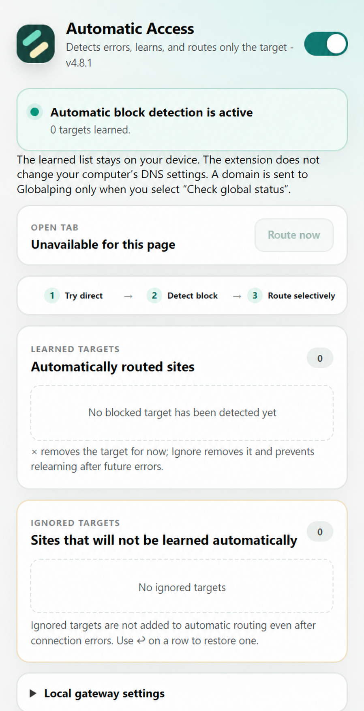

[English](README.md) | **Türkçe**

# Otomatik Erişim

Bağlantı hatası yaşayan hedefleri öğrenip yalnız bu alan adlarını kullanıcının bilgisayarındaki yerel SOCKS5 uyumluluk geçidine yönlendiren Manifest V3 Chrome eklentisi.

Güncel sürüm: **4.10.0**

Eklenti arayüzü Chrome'un arayüz dili Türkçeyse Türkçe, diğer bütün dillerde İngilizce gösterilir.



Proje işareti, engellenmiş doğrudan yolun çevresinden geçen alternatif rotayı gösterir.

## Temel davranış

- Normal çalışan bağlantılar doğrudan kalır.
- Tek bir geçici hata hedefi otomatik olarak yönlendirmez.
- Doğrulama isteği tam adresi tekrarlamaz; kullanıcı bilgisi, yol, sorgu ve fragment kaldırılarak yalnız origin kökü çerezsiz sınanır.
- Kontroller alan adı bazında yürütülür. Bir hedefteki gecikme diğer alan adlarını bekletmez ve aynı anda en fazla üç doğrulama yapılır.
- Ana hedef kurtarılırken sonradan öğrenilen sayfa bağımlılıkları kısa bir sakinleşme penceresinde toplanır; gerekirse tek seferde yeniden denenir ve yenileme döngüsü sınırlandırılır.
- Öğrenilen kurallar yalnız hatayı veren tam alan adına uygulanır.
- Yönlendirilmiş bir ana sayfa açıldıktan sonra origin kökü ara sıra geçit olmadan iki kez doğrulanır. İki kontrol de yanıt alırsa eşleşen alan adı takma adları yönlendirmeden çıkarılır ve kullanıcıya bildirilir.
- Özel, yerel ve link-local IPv4/IPv6 adresleri yönlendirme dışında tutulur.
- Öğrenilen ve yoksayılan alan adları yalnız `chrome.storage.local` içinde saklanır.
- Eklenti veya yardımcı DNS sağlayıcısını, sistem DNS ayarlarını ve modem yapılandırmasını değiştirmez.
- Araç çubuğu rozeti açık sekmenin durumunu gösterir: doğrudan yol için yeşil `DIR`, yerel geçit için mavi `VIA`, yeni öğrenilen hedef için camgöbeği `NEW`, kontrol veya süren sorun için turuncu `?`, kesinti veya geçit hatası için kırmızı `DOWN` ya da `!`, kapalı durum için gri `OFF`, tarayıcının iç sayfalarında gri `N/A`.

Bu araç VPN değildir; IP adresini veya ülkeyi değiştirmez. Yalnız kullanıcının erişim yetkisi bulunan hedeflerde ve yürürlükteki kurallara uygun kullanılmalıdır.

## Kurulum

> Şu anda Windows ve Google Chrome desteklenir.

1. Depoyu indirin veya klonlayın.
2. Chrome'da `chrome://extensions` sayfasını açın.
3. **Geliştirici modu**nu açın ve **Paketlenmemiş öğe yükle** ile proje klasörünü seçin.
4. `helper/install.cmd` dosyasını **Yönetici olarak çalıştır** seçeneğiyle bir kez çalıştırın.
5. Eklenti kartındaki yenile simgesine basıp popup anahtarını etkinleştirin.

Yönetici izni yalnız Windows hizmetinin kurulması ve kaldırılması için gerekir. Eklenti yenileme veya ayar değişikliği PowerShell, komut penceresi ya da UAC istemi başlatmaz.

## Güncelleme

1. Depo dosyalarını güncelleyin.
2. `chrome://extensions` içindeki eklenti kartının yenile simgesine basın.
3. `helper/` içeriği değişmişse `helper/install.cmd` dosyasını yeniden çalıştırın.

## Kaldırma

1. Eklentiyi Chrome'dan kaldırın.
2. `helper/uninstall.cmd` dosyasını yönetici olarak çalıştırın.

Kaldırıcı yalnız bu projeye ait yerel hizmeti ve kurulum klasörünü kaldırır; DNS veya başka sistem ağ ayarlarına dokunmaz. İşlem doğrulanamazsa başarı mesajı yerine hata döndürür.

## İzinler

- `webRequest` ve HTTP/HTTPS/WS/WSS erişimi: desteklenen bağlantı hatalarını ve başarılı ana sayfa yanıtlarını algılamak.
- `proxy`: yalnız öğrenilen alan adları için yerel PAC/SOCKS5 yönlendirmesi uygulamak.
- `storage`: ayarlar ile öğrenilen, yoksayılan ve isteğe bağlı teşhis kayıtlarını cihazda saklamak.
- `activeTab`: popup açıldığında etkin sekmenin alan adını göstermek ve kullanıcı işlemini o sekmeyle ilişkilendirmek.
- `notifications`: yeni öğrenilen hedefi, geri gelen doğrudan erişimi ve kullanıcı tarafından başlatılan durum kontrolü sonucunu bildirmek.
- `scripting`: otomatik öğrenilen harici iframe'i üst sayfayı yenilemeden tekrar yüklemek.

Eklenti uzaktan JavaScript çalıştırmaz, sayfa içeriği toplamaz, HTTPS şifresini çözmez ve özel sertifika kurmaz.

## Yerel yardımcı

Yerel geçit yalnız `127.0.0.1:1080` üzerinde dinler. Windows hizmeti kısıtlı `LocalService` hesabıyla, gecikmeli otomatik başlangıç ve kontrollü yeniden başlatma politikasıyla çalışır. Kurulum:

- paketlenen ikilinin SHA-256 değerini kopyalamadan önce ve sonra doğrular;
- klasörü yalnız SYSTEM, yöneticiler ve hizmet hesabının erişebileceği ACL ile sınırlar;
- DNS, NRPT, kayıt defteri veya zamanlanmış görev oluşturmaz ve silmez.

Üçüncü taraf ikilinin kaynak, sürüm, hash ve lisans bilgileri `helper/bin/SOURCE.md` ile `THIRD_PARTY_NOTICES.md` dosyalarındadır.

## Teşhis ve genel durum kontrolü

Hata ayıklama günlüğü varsayılan olarak kapalıdır. Açıldığında son 150 sınırlı olayı cihazda tutar; kayıtlar toplu yazılır ve tam URL, sorgu, çerez, form verisi veya sayfa içeriği içermez.

**Genel durumu kontrol et** işlemi yalnız kullanıcı düğmeye bastığında çalışır. Kontrol edilen alan adı [Globalping](https://globalping.io) API'sine gönderilir; otomatik dış sorgu yapılmaz.

## Gizlilik ve güvenlik

- Geliştirici telemetrisi, analiz sunucusu, reklam veya affiliate kodu yoktur.
- Gezinme verileri satılmaz ve reklam hedeflemede kullanılmaz.
- Ana anahtar kapatıldığında Chrome proxy ayarı temizlenir.
- Başka bir eklenti veya yönetici proxy ayarını kontrol ediyorsa bu eklenti onu geçersiz kılmaz.
- Bildirim Chrome tarafından kabul edildiği halde görünmüyorsa işletim sisteminin bildirim ve rahatsız etmeyin ayarları geçerlidir.

Ayrıntılar: `PRIVACY.md`, `SECURITY.md` ve `RESPONSIBLE_USE.md`.

## Geliştirme doğrulaması

```text
node --check background.js
node --check popup.js
node tests/background.test.cjs
node scripts/repository-audit.cjs
node scripts/repository-audit.cjs --history
```

Denetim; izin-belge uyumunu, hassas veri ve genel hedef adlarını, DNS/PowerShell yasağını, ikili hash'ini, hizmet hesabını, dinamik kod kullanımını ve Git geçmişini kontrol eder.

## Sınırlar

- Yalnız Chrome trafiğini kapsar.
- Gerçek sunucu kesintisini veya internet bağlantısı kaybını düzeltemez.
- Ağ sağlayıcıları değiştikçe yerel uyumluluk profili güncelleme gerektirebilir.
- Kaynak kod belirli bir kullanıcıya, cihaza, ağa veya gerçek hedef listesine göre özelleştirilmez.

## Lisans

Projenin özgün kodu MIT lisanslıdır. Birlikte dağıtılan üçüncü taraf bileşenler kendi lisans koşullarına tabidir.

<p align="center">
  <a href="https://buymeacoffee.com/ezerche">
    
  </a>
</p>
